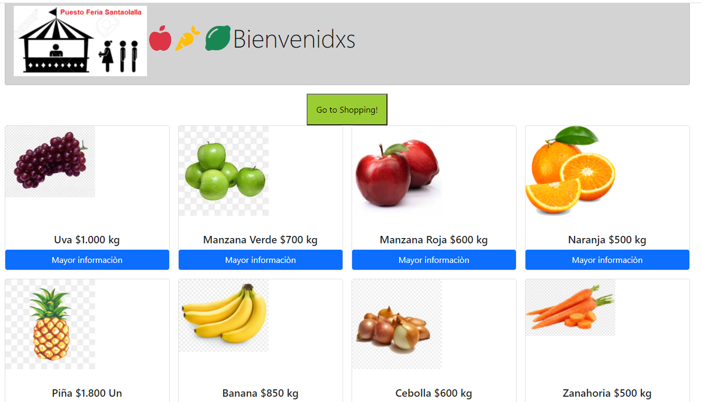

# Puesto de Feria Web
### Descripción
La familia Santaolalla tiene un puesto en la feria, que vende frutas y verduras.  
Tiene tantosproductos que se les olvida qué productos tienen, lo que demora la atención a los clientes  
y a veces ofrecen productos que ya se les han acabado.   
Por lo que nos piden a nosotros que implementemos una aplicación sencilla que les permita:  

1.- vender y agregar productos nuevos,  
2.- crear una aplicación donde puedan listarlos.

Se ha mejorado en relación a las buenas prácticas en la conformación de los directorios   
y la confirmación de los componentes Produtos y producto .tsx  

### Requerimientos
- Crear y limpiar proyecto React (npx create-react-app puestoferia-web)  
    - Se cambia README.
    - El proyecto se crea como un proyecto React com Typescript. (yarn add --dev typescript)
    - Se agrega Bootstrap. (<!-- Bootstrap CSS -->)
    - Se eliminan todos los archivos que no se utilizan en el proyecto.
    - Se elimina CSS que no se utiliza en el proyecto.
    - Se elimina JSX que no se utiliza en el proyecto
- Importar productos y mostrarlos en pantalla.  
    - Cada producto se muestra dentro de un componente Product.
    - Los productos son iterados dentro de un componente ProductList.
    - La iteración se hace dentro de un map.
    - En la iteración se agrega key.
    - Los productos se importan de un archivo JSON.  
- Crear componentes y contenedores  
    - Todos los componentes son TSX.
    - Separar componentes en containers y componentes.
    - Nombre de todos los componentes siguen el estándar PascalCase.
    - Utiliza interfaces para validar datos en los componentes.  
- Agregar y utilizar css modular  
    - Utiliza al menos 2 veces CSS modular.  
    - Utiliza CSS normal.   
- Configurar con Git/npm el código alojado en Github  
    - Repositorio en Github con el código, script se ejecuta con `npm run start`,
    - Proyecto iniciado con Git y npm.
    

#  Vista preliminar 

    

